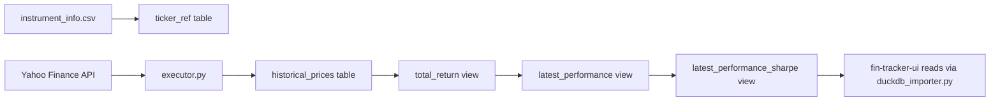
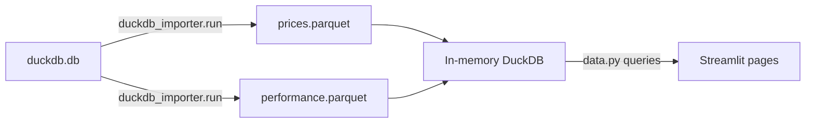

# Project Architecture

Two repos work together: **fin-tracker** (data pipeline) feeds **fin-tracker-ui** (Streamlit dashboard).

## fin-tracker — Data Pipeline

**Location**: `/Users/dbg/code/IdeaProjects/fin-tracker`

### Purpose
Downloads daily ETF/instrument prices from Yahoo Finance, stores them in DuckDB, and computes performance views (returns, moving averages, volatility, drawdowns, Sharpe ratios).

### Key Files

| File | Purpose |
|------|---------|
| `fintracker/executor.py` | Main entry point. Downloads prices via `yfinance`, handles dividend rewrites, inserts into DuckDB |
| `fintracker/consts.py` | All constants: DB path, table schemas, SQL view definitions. Loads `latest_performance.sql` at import time |
| `fintracker/utils.py` | DuckDB connection pool, `JobDef` dataclass, `missing_timerange()` to find gaps, `insert_df_to_duckdb()` |
| `fintracker/process_data.py` | Experimental volatility calculation (historical_volatility table) |
| `resources/instrument_info.csv` | Master list of tracked instruments (ticker, description, currency, fund_type, url) |
| `resources/latest_performance.sql` | SQL views: `total_return`, `instrument_annualised_volatility`, `instrument_monthly_volatility`, `latest_performance`, `latest_performance_sharpe` |
| `Makefile` | Targets: `run`, `run-rewrite`, `run-postgres`, `cron`, `clean` |
| `duckdb.db` | The DuckDB database file (at repo root) |

### Data Flow



### DuckDB Tables & Views

| Name | Type | Description |
|------|------|-------------|
| `historical_prices` | Table | Raw OHLCV + dividends + splits per ticker per day |
| `ticker_ref` | Table | Created from `instrument_info.csv` on each run |
| `data_backups` | Table | Tracks CSV backups made before dividend rewrites |
| `total_return` | View | Joins prices with FX rates, converts everything to GBP |
| `instrument_annualised_volatility` | View | Rolling 252-day log-return stddev, annualised |
| `instrument_monthly_volatility` | View | Rolling 21-day log-return stddev |
| `latest_performance` | View | Returns (1d→5y), MAs (21/63/126/252), z-scores, drawdowns (52w/3y), vol |
| `latest_performance_sharpe` | View | Adds Sharpe ratios (return - risk-free / vol) using CSH2 as risk-free |

### Instrument Info CSV Format

```
ticker,description,currency,fund_type,url
CSP1.L,Core S&P 500 UCITS,GBP,eq,https://...
```

**Fund types**: `eq`, `eq-reit`, `commod`, `bonds`, `bonds-em`, `bonds-corp`, `bonds-il`, `bonds-cash`, `currency`

### Running

```bash
cd /Users/dbg/code/IdeaProjects/fin-tracker
make run          # incremental update
make run-rewrite  # full rewrite (no backup)
make cron         # cron-friendly with logging
```

The `cron` target is scheduled via a `launchd` agent (`~/Library/LaunchAgents/com.fintracker.import.plist`).

---

## fin-tracker-ui — Streamlit Dashboard

**Location**: `/Users/dbg/code/fin-tracker-ui`

### Purpose
Streamlit multi-page app that reads from the DuckDB database (via encrypted Parquet files) and displays performance tables, charts, screeners, and scanners.

### Key Files

| File | Purpose |
|------|---------|
| `app/PerformanceTable.py` | Main page. Performance table with Sharpe ratios, custom sorting, correlation matrix |
| `app/duckdb_importer.py` | Reads DuckDB, exports to encrypted Parquet. Defines all column name constants |
| `app/data.py` | Query builder + data access layer. `get_conn()`, `create_query()`, `get_data()` |
| `app/config.py` | Constants: benchmarks, chart sizes, risk-free rate |
| `app/utils.py` | Plotting (Altair/Plotly), table styling, correlation matrix, dataframe filtering |

### Data Loading Architecture



On first load (`PerformanceTable.py`), `duckdb_importer.run()` exports DuckDB views to encrypted Parquet. The UI then reads from Parquet into an in-memory DuckDB connection.

**Environment variable required**: `PARQUET_ENCRYPTION_KEY`

### Available Column Constants (from `duckdb_importer.py`)

| Constant | Columns |
|----------|---------|
| `perf_desc_cols_start` | `date`, `description` |
| `perf_desc_cols_end` | `ticker`, `fund_type` |
| `perf_vol_cols` | `vol_1mo`, `vol_1y` |
| `perf_mavg_cols` | `ma_21`, `ma_63`, `ma_126`, `ma_252`, `drawdown_52w`, `drawdown_3y` |
| `perf_returns_cols` | `r_1d` through `r_5y` (10 periods) |
| `perf_sharpe_cols` | `r_1d_s` through `r_5y_s` |
| `perf_z_score_cols` | `z_1d`, `z_1w`, `z_2w`, `z_1mo` |
| `perf_rownames_cols` | `rown` (row number, 1 = latest day) |

### Pages (11 total)

| Page | Purpose |
|------|---------|
| `PerformanceTable.py` | Main table with returns/Sharpe, custom sorting, price charts |
| `AssetCorrelation.py` | Correlation analysis between selected assets |
| `BreakoutScanner.py` | **NEW** — MA breakouts, multi-MA strength, 52W highs, treemap heatmap |
| `CrossAssetRegime.py` | Cross-asset regime detection (equity/bond/commodity relationships) |
| `FactorDashboard.py` | Factor ETF performance comparison (value, growth, quality, etc.) |
| `PerformanceChart.py` | Interactive price charts for selected instruments |
| `PortfolioManager.py` | Portfolio tracking with broker-level holdings |
| `PukeDetector.py` | Extreme selloff detection using z-scores and drawdowns |
| `PullbackScanner.py` | Pullback candidates in uptrends + trend reversal detection |
| `SectorScreener.py` | Oversold sectors + underperformer recovery scoring |
| `SentimentWidget.py` | Market sentiment indicators |
| `ThematicDashboard.py` | Thematic/megatrend ETF comparison with heatmaps |

### Running

```bash
cd /Users/dbg/code/fin-tracker-ui
source .venv/bin/activate
cd app
streamlit run PerformanceTable.py
```

### Benchmarks (from `config.py`)

| Label | Ticker |
|-------|--------|
| S&P 500 | CSP1 |
| MSCI USA | CUSS |
| MSCI Europe | IMEA |
| Emerging Markets | EEM |
